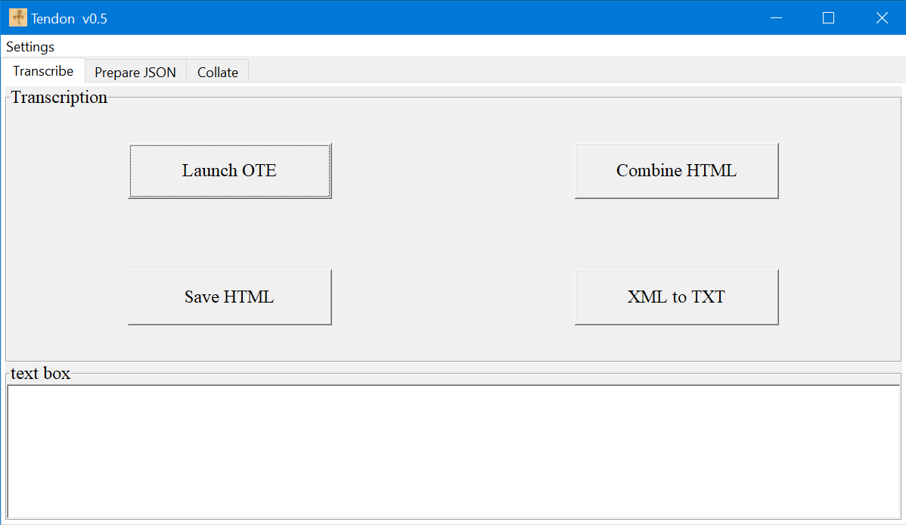
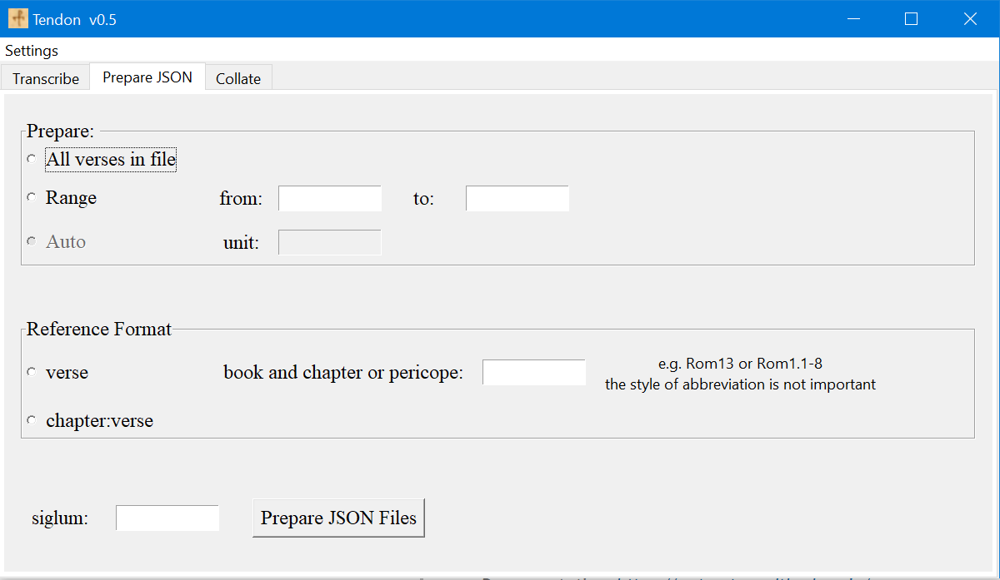
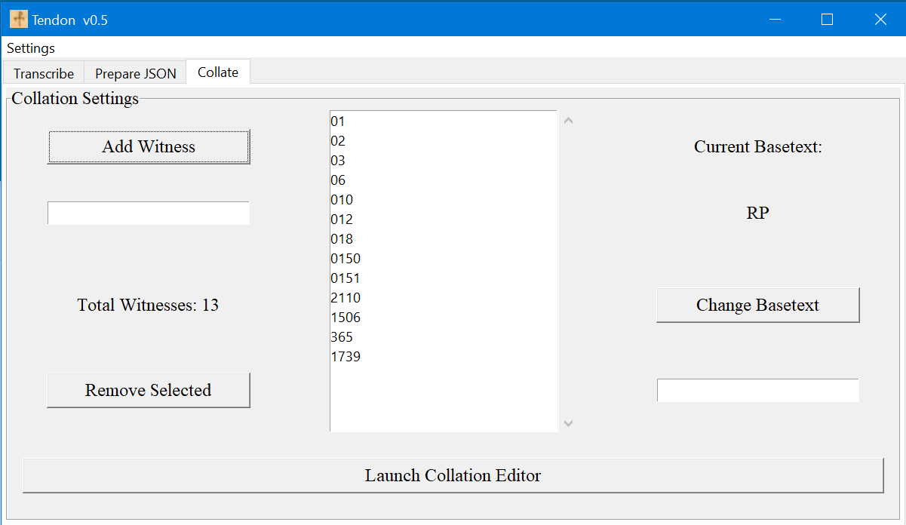

# About Tendon

This application exists to help connect previously existing and excellent tools used for transcription and collation of ancient texts. It has been created to help with my own doctoral research and so its features will be naturally limited to what is is useful to me. I do hope, however, that others working on ancient manuscripts will find it helpful as well.

The tools that Tendon connects are: 1) the [Online Transcription Editor](https://sourceforge.net/projects/wfce-ote/) (OTE) and 2) the [Collation Editor](https://github.com/itsee-birmingham/standalone_collation_editor) (CE).

* The OTE is a powerful tool developed (and continually updated) by Martin Sievers and others from [INTF](http://egora.uni-muenster.de/intf/index_en.shtml) and [ITSEE](https://www.birmingham.ac.uk/research/itsee/index.aspx) for transcribing handwritten documents. It is essentially a plugin for [TinyMCE](https://www.tiny.cloud/), a WYSIWYG HTML text editor. It allows the user to transcribe text as anyone would normally use a word processor for, but the OTE's text can be exported as fully encoded TEI XML. The OTE's visual representation of such things as scribal corrections and marginalia make it an ideal solution for manuscript studies. There are two main ways to access the OTE:
    - ITSEE hosts a dedicated standalone version [here](https://itsee-wce.birmingham.ac.uk/ote/transcriptiontool).
    - It is also available to download [here](https://sourceforge.net/projects/wfce-ote/). 
        * I prefer to use the OTE running locally on my own computer because:
            - I am not required to have an internet connection to transcribe.
            - The web based OTE exports to XML but not HTML, whereas I can export to either format in the downloadable version.
        * There is some additional functionality in Tendon if the OTE is run locally instead of online.

* the CE is developed and maintained by ITSEE and the University of Birmingham. At the heart of the CE is the command line tool, [CollateX](https://collatex.net/). CollateX is a powerful tool for collating (comparing and presenting differences) texts. The Collation Editor is a GUI that adds additional helpful functionality. Most significantly, the CE allows for a user to edit the collation by manually aligning variation units and to regularize readings.

## Tendon 'connects' the Transcription and Collation editors
The problems that I and my fellow researchers encounter are: 
1. The OTE output is XML, but the CE input must be JSON files. The output of the CE is one XML TEI collation file. For the average person, this means that it is impossible to connect the tools without technical help.
2. The CE fails when the input files are too large. This limits the user to collating one verse at a time, which in turn produces one collation file per verse.

### Tendon offers limited solutions to these issues and adds other workflow enhancements:
1. The HTML of each page of a manuscript can be pasted into Tendon, saved to a manuscript folder, and later all single-page HTML files can be combined prior to exporting them as a complete TEI XML transcription.

2. Tendon will convert the TEI XML into a plain text file with uncertain letters and lacunae preserved as underdots and bracketed text.
    - This intermediary step of TEI to plain text is because I wanted to have a simple and easily searchable representation of my transcriptions in addition to the document-accurate TEI version. The format of this output is one verse per line with full references (e.g., "Rom 1:1 παυλος.....Rom 1:2..."). Words that a broken because of a newline are reliably restored because the TEI XML is parsed when converted to plain text.

3. Tendon can convert a plain text file into the JSON files that can be loaded by the CE.

    - The user can choose whether to convert an entire text document or any range of verses in that document.
    - Once the selection of verses is determined, Tendon identifies individual verses and creates everything that is required by the CE: a witness directory, metadata JSON file, and one JSON formatted transcription file per verse.
    - By choosing to convert from plain text into JSON, I am choosing not to transfer the full breadth of data that is preserved in the TEI version. For my purposes, this is has been sufficient. While I am keeping track of other features such as scribal corrections, I am happy to collate only the first hand. For lacunose sections of text, this is easily indicated inside the CE GUI, even though it is possible to encode it into the JSON files ahead of collation.

4. Tendon allows the user to easily edit the CE configuration file; this is how one adds or removes witnesses to be collated and which witness should be the basetext.

5. The result of this workflow is a collation of one verse or other small unit of text. I have another tool, the [Apparatus Explorer](https://github.com/d-flood/apparatus-explorer), which can combine these individual verse-collation files into larger files comprising, for example, a whole chapter or book.

# Dependencies
* Presently, Python 3.6+ and the following external libraries are required:
    - [lxml](https://lxml.de/) for processing TEI XML files
    - [natsort](https://pypi.org/project/natsort/) for ensuring that all files in a directory are combined in their expected order.

I have considered releasing a Windows executable, _however_, the CE also requires Python3, so anyone wanting to use these tools must install Python anyways.

* Since Tendon is intended to 'connect' the OTE and the CE, these are obviously dependencies.
    - I recommend keeping Tendon, the OTE and the CE in the same directory, though it is not necessary since the paths to each tool can be set using the dropdown settings menu in Tendon.
    - Once the paths to the OTE and CE are set, each can be launched from within Tendon.

# Instructions
to be completed