# Tendon
This is a collection of computer tools for aiding the text critical workflow from transcription to collation to analysis.
Some of the tools already exist as CLI's that I have made, but here are are collected into one place and converted to user-friendly GUI applications.

## The Problem I'm trying to Solve
The standard tool for transcribing ancient New Testament manuscripts ([ITSEE's OTE](https://itsee-wce.birmingham.ac.uk/ote/transcriptiontool)) produces files in an entirely different format from that required by the standard tool for collating these transcriptions ([the WCE Collation Editor](https://github.com/itsee-birmingham/standalone_collation_editor)).

Moving from transcription to collation to analysis requires several steps of intermediate conversion of the data along the way. Tendon is a collection of tools to help 'connect' these three basic tasks.

## What Tendon Does
Tendon is a desktop app with nine distinct tools:
1. Convert a plain text transcription of a chapter or other unit into single-verse JSON files properly formatted for use in the Collation Editor. This is the simplest way to get data into the Collation Editor.
2. Get a consolidated plain text file from an entire folder of JSON files.
3. Convert a repurposed superset of Markdown to TEI XML. Included is a graphical user interface (GUI) to my CLI [MarkdownTEI](https://github.com/d-flood/MarkdownTEI). This is presented as simple and offline alternative to the [Online Transcription Editor (OTE)](https://itsee-wce.birmingham.ac.uk/ote/transcriptiontool). MarkdownTEI converted files can even be uploaded to the OTE.
4. Convert TEI transcriptions (from MarkdownTEI or the OTE) to single-verse JSON files for use in the Collation Editor. This is a GUI version of my [TEI to JSON](https://github.com/d-flood/TEI-to-JSON) CLI.
5. Combine any number of single-verse collation files produced by the Collation Editor.
6. Reformat the collation file output of the Collation Editor for use with the [open-cbgm](https://github.com/jjmccollum/open-cbgm-standalone) and with Apparatus Explorer (a [desktop](https://github.com/d-flood/apparatus-explorer) and [web app](https://davidaflood.com/appex/demo/)) for visualization and editing.
7. Provide a simple way to view TEI XML transcriptions offline using the same styling as the [IGNTP online transcriptions](http://www.itseeweb.bham.ac.uk/epistulae/XML/igntp.xml).
8. Provide an interface to conveniently edit the project configuration. This is how one chooses which witnesses to collate, and which witness should be the basetext.
9. A simple graphical interface for the [open-cbgm](https://github.com/jjmccollum/open-cbgm-standalone) CLI application. This tool is windows only right now.

## Installation
### Windows standalone version
Download and install the MSI from this repository.

### MacOS standalone version
*Experimental*: Download the ***unsigned*** DMG [v0.12 here](https://1drv.ms/u/s!AqSbnTiqn1jcicxJbAWy8aPUrUX5mQ?e=WLArVb)

### Run on any platform with Python 3.6+
Dependencies
- `lxml`
- `natsort`
- `PySide2`
- `PySimpleGUIQt`
- `Markdown==3.2.2`
- `markdown-del-ins`

With the dependencies installed, go to `<root>/src/` and call `python -m tendon`

## Brief Tutorial
Please [contact](https://www.davidaflood.com/contact/), message me on Twitter, or fill out a GitHub issue for help using these tools and to report bugs. There are certain to be untested edge cases especially when converting TEI to JSON.

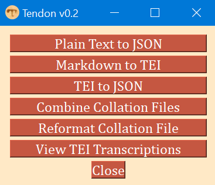

### Plain Text to JSON Files
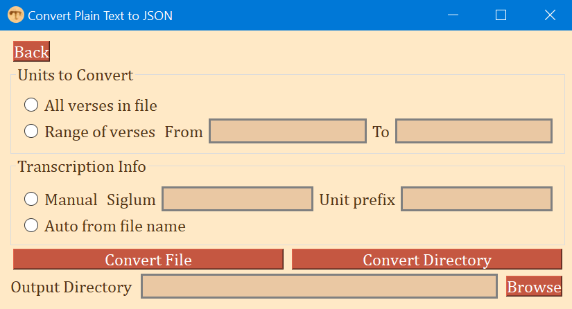
The structure of the plain text (.txt) file is important. Tendon assumes:
- One verse (or other unit) per line
- Each line begins with the verse number
- There is no more than one whole chapter (or other complete unit) per file

1. Choose whether to convert all verses in a text file or to convert a range of verses (can be one verse, e.g. '3 to 3').
   - If "Range of verses" is selected, than a first ('from') and last ('to') verse must be entered. These input values must match verse numbers in the file, e.g. '7 to 12' *not* '1:7 to 1:12'.
   - If "All verses in file" is selected, then every verse will be converted to a different JSON file.
2. Choose whether to provide Tendon with the witness siglum or to have Tendon try and get this information from the input text file name.
   - If "Manual" is selected, then Tendon will use the user provided siglum and unit prefix.
     - The siglum is an identifier for the witness, e.g. 'P52'
     - The unit prefix is whatever needs to be added to the verse number to make it a full reference. This is normally the book and chapter (*with no spaces*), e.g. "Rom14", "Rom_14", "R14", "B06K14V". With this information, Tendon can create the correct directories and filenames for every verse to be converted.
   - If "Auto from file name" is selected, then Tendon will get the siglum and unit prefix from the file name *if the following convention is observed:* `<siglum>_<unit prefix>.txt`. That is, the filename should consist of the siglum, followed by an underscore, followed by the book and chapter. E.g., `P46_Rom14.txt`.
3. Choose the output directory by clicking "Browse" and navigating to the right folder.
   - If you have downloaded the Collation Editor, go to that folder and to `/collation/data/textrepo/json/`. This is where the Collation Editor expects the transcription files to be.
4. Finally, click "Convert File".
   - You will be prompted to select a plain text file.
   - Upon selecting it Tendon will attempt to convert the specified verses from the file and save them into the chosen output directory.
   - Tendon creates a folder in the output directory named after the siglum and then deposits the converted verses from that witness into the folder.
   - Tendon also creates and places a `metadata.json` file that must exist for the Collation Editor to work.
5. Caution. If you have many plain text transcription files in the same folder, and all adhere to the naming convention required by "auto from file name", then all chapter files can be converted at once by clicking "Convert Directory". 
   - This can easily result in the creation of hundreds or thousands of JSON files (which may be what you want!). So, make sure to test one of the files to ensure that its format is compatible and that the result is satisfactory before converting an entire folder.

### Get Plain Text from JSON Files
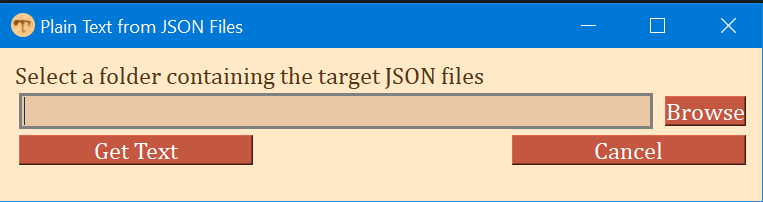

This is a simple module for extracting the plain text of the first hand of a witness and exporting it as plain text. The output of this feature will produce a single plain text file with one verse per line, each line started with the verse number, and chapter headings.
1. Select a folder that contains the JSON files from which a plain text version is to be extracted. These JSON files are assumed to have been produced by Tendon.
2. Click "Get Text".
3. You will be prompted to save the text file.

### MarkdownTEI
This tool began as a [CLI](https://github.com/d-flood/MarkdownTEI) but here it is much more user-friendly as a GUI.
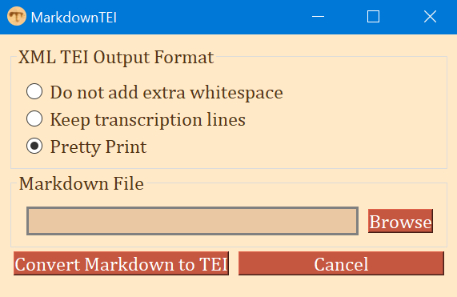
1. Choose how Tendon should format the converted transcription file. All options can be read by a computer but they differ most in human-readability.
   - "Do not add extra whitespace"
    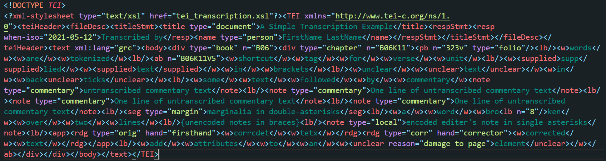
   - "Keep transcription lines"
    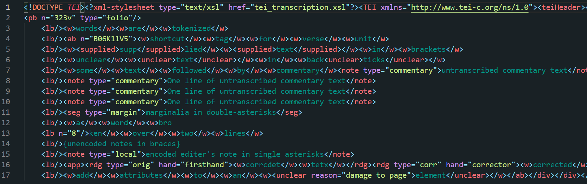
   - "Pretty Print"
    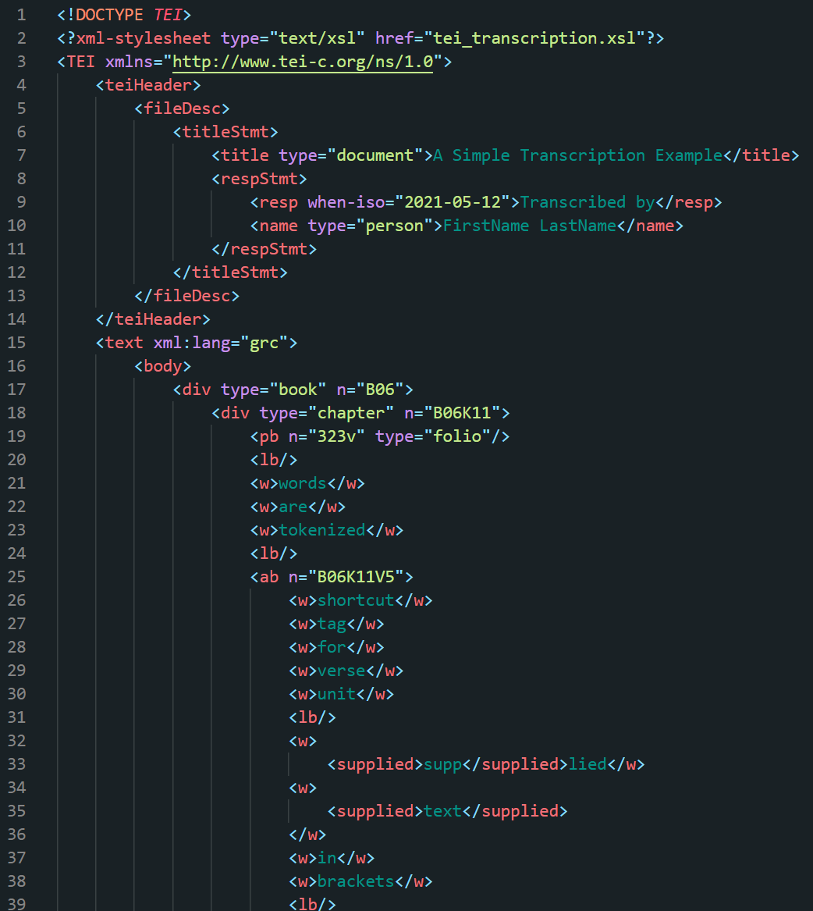
2. Select the Markdown (.md) file to be converted by clicking "Browse".
   - You will then be prompted to choose the converted file's location and name.

### TEI to JSON
This is the most difficult task. The TEI XML produced by the WYSIWYG OTE is very flexible and it is difficult to predict all of the possible combinations and nested encodings. Please tell me about bugs and edge cases.
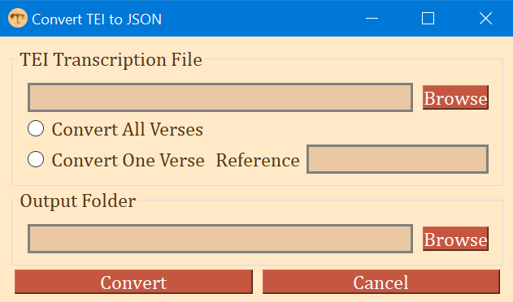
1. Select the TEI transcription file to be converted.
   - This can be the output of MarkdownTEI (most reliable) or the OTE.
2. Choose whether to convert all of the TEI transcription file or one verse.
   - Converting one verse is useful for correcting errors discovered in transcriptions during the collation process.
   - When working with TEI transcriptions, the verse reference format follows the IGNTP/INTF style, e.g. "B06K13V1" (B06 = Romans, K13 = chapter 13, V1 = verse 1).
3. Select the output folder where chapter folders and verse files are created and saved.
   - This should be located by going to the root folder of the Collation Editor and navigating to `/collation/data/textrepo/json/`.
4. Then click "Convert".

### Combine Collation Files
I've found that the Collation Editor fails to process more than a dozen verses at one time and it is best used one verse at a time. For analysis, these individual verse collation files should be combined into chapter and book length files.
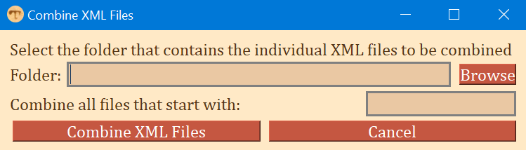
1. Navigate to the folder that contains all of the files you want to combine by clicking "Browse".
2. Enter a bit of text to filter all files to be combined.
   - E.g., entering "Rom13" would combine "Rom13.1.xml" and "Rom13.2.xml" but not "Rom14.1.xml" while entering "Rom" would result in combining them all.
3. Click "Combine XML Files". You will then be prompted to select the name and location of the combined file.

### Reformat Collation File
The output of the Collation Editor has several redundancies and lacks some useful features that are needed for the file to be used as input for the open-cbgm or the Apparatus Explorer.
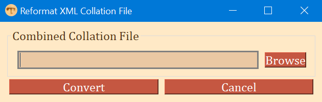
1. Select an XML collation file that was combined during the previous step by clicking "Browse".
2. Click "Convert". You will then be prompted to save the reformatted file.

### View TEI Transcriptions
This is a simple way to view TEI transcriptions with the same styling applied to equivalent TEI transcriptions by the IGNTP.
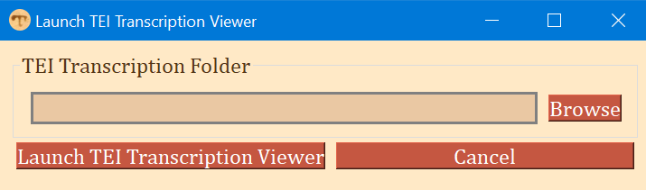
1. Select a folder that has one or more TEI transcriptions in it. TEI transcriptions created with MarkdownTEI will work automatically, while others will need to have the style linking element inserted.
2. Click "Launch TEI Transcription Viewer".
   - For MacOS users, ensure that Firefox is installed since this stylesheet was created by ITSEE and the IGNTP for Firefox.
   - Launching the viewer starts a local server and launches Firefox on MacOS and the default browser on Windows.
    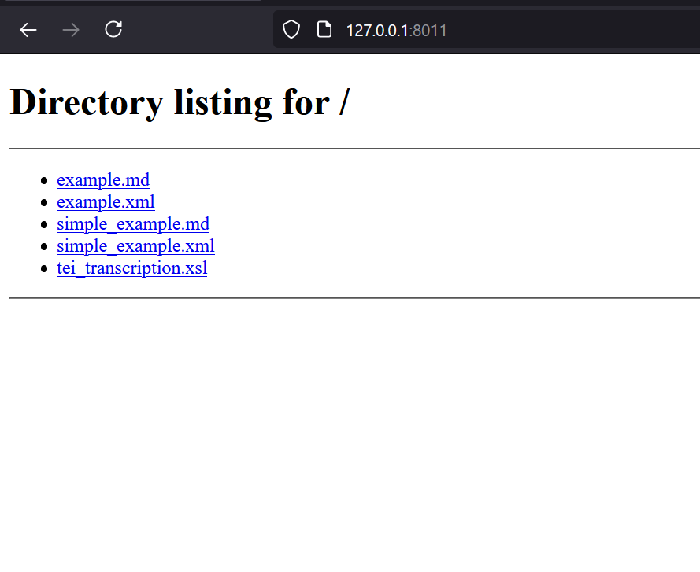
   - Click on a TEI transcription to view it fully formatted and styled.
    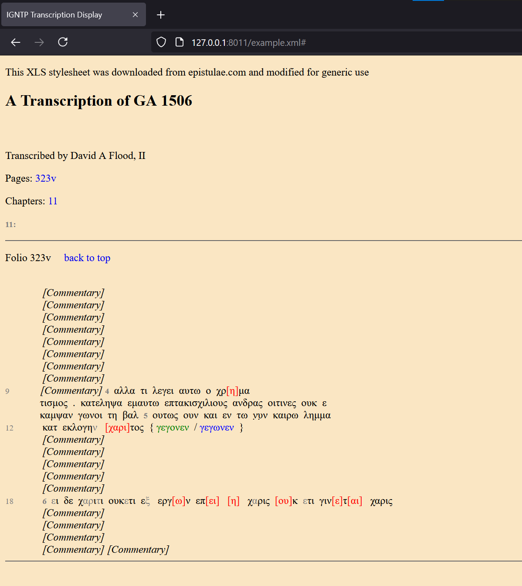

### Configure Collation Editor
The WCE Collation Editor is configured by manually editing a config file located at `<root>/collation/data/project/default/config.json`. The Collation Editor is launched by a convenient start up script distributed with the Collation Editor (`startup.sh` for MacOS and `startup.bat` for Windows). This module of Tendon provides convenient access to the important values in the config file. This module also contains a shortcut for launching the Collation Editor.

Note, however, that the Collation Editor has its own dependencies: Python 3 and the JVM.

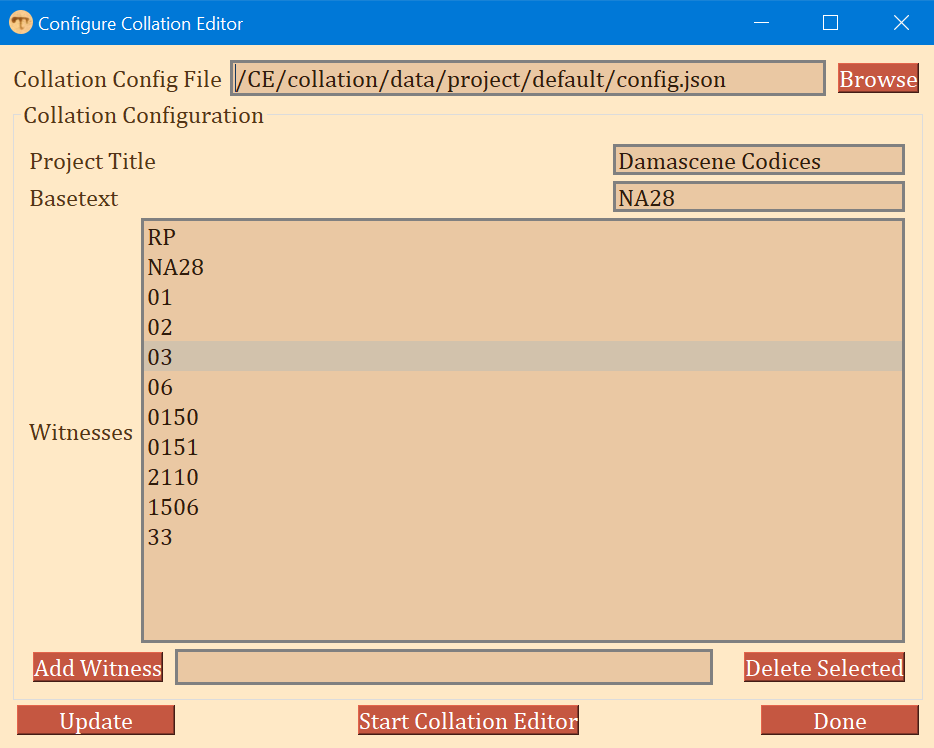

1. Browse for the config file. Begin in the root folder of the Collation Editor and go to `/collation/data/project/default/config.json`. Once it is selected, click "Update" at the bottom to load the configuration settings.
2. The "Project Title" is not important. Change it to whatever you like. It will be displayed in the Collation Editor.
3. The "Basetext" is whichever witness you want all others to be collated against. The basetext must be prepared as json files just like any other witness.
4. The "Witnesses" section tells the Collation Editor which witnesses should be included in the collation. This might change from verse to verse, but most likely it will not, since missing witnesses will be interpreted as lacunose for the entire verse.
5. Add a witness to the list by typing its siglum or witness ID into the field and pressing "Enter" or clicking "Add Witness".
6. Select one or more witnesses from the list, then click "Delete Selected" to remove these from the configuration file.
7. "Update" is only needed to save the "Project Title" and "Basetext". The "Witnesses" are saved any time one is added or deleted.
8. "Start Collation Editor" will attempt to locate the appropriate start up script and execute it. It will also attempt to open Firefox (by far the best for working in the Collation Editor) to the right port.

### open-cbgm Interface
This is a GUI front end for [Joey McCollum's open-cbgm: a flexible and fast implementation](https://github.com/jjmccollum/open-cbgm-standalone) of the Coherence Based Genealogical Method. Only a few of the open-cbgm features are implemented in this interface at present. More will be added as I need them for my own research.

#### Manage Databases
The first tab of this interface is a prerequisite for doing anything with the open-cbgm.
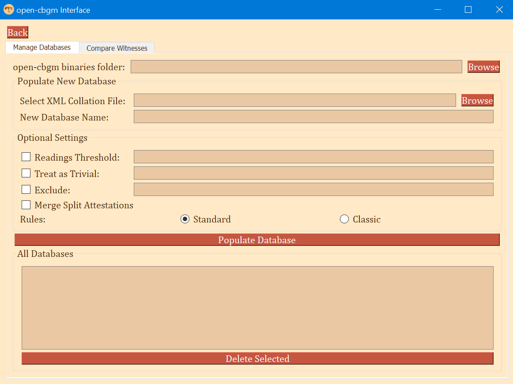
The two prerequisites for using the open-cbgm are:
1. Having an XML collation file with which to feed the open-cbgm. This can be created by hand, but normally this will be the output of the output of the Collation Editor (see "Combine Collation Files" and "Reformat Collation File" above).
2. Installing the open-cbgm. Joey has provided [excellent instructions](https://github.com/jjmccollum/open-cbgm-standalone#installation-and-dependencies) for Windows, Mac, and Linus.

Using Tendon with the open-cbgm:
1. The first (and one time) step is to tell Tendon where you have installed the open-cbgm, and specifically to designate the folder containing the executable files (files ending in ".exe" on Windows).
2. Browse and select an XML collation file (which should be prepared using the steps mentioned above).
3. The open-cbgm takes the XML file as input and produces a database. Enter a name for this database. You can create many databases. I recommend naming the database in a way that indicates its content and settings (see next steps below). 
- The remaining options are optional. See Joey's [documentation](https://github.com/jjmccollum/open-cbgm-standalone#population-of-the-genealogical-cache) for what these options do. Remember that this is merely an interface for his software.
4. Check the "Readings Threshold" box to limit witnesses to those that are extant at a given number of variation units. Enter this number in the field on the right.
5. Check the "Treat as Trivial" box to designate which reading types should be treated as agreeing with their parent reading. Enter one or more reading types separated by a space or comma and space. 
   - NOTE: This presumes that reading types have been added to the XML collation file.
   - Some reading types are added with the Collation Editor: "subreading" is a type added automatically to any reading that has been regularized by the user during collation.
   - Custom reading types can be added by hand in the XML file, or by using my [Apparatus Explorer](https://github.com/d-flood/apparatus-explorer) in either its desktop or web application version.
6. Check the "Exclude" box to designate reading type(s) to be entire omitted and treated as lacunose.
7. Checking "Merge Split Attestations" will "will treat split attestations of the same reading as equivalent for the purposes of witness comparison."
8. Finally, decide whether to use Joey McCollum's updated rules (standard) for genealogical relationships or to use the same rules used by INTF's implementation (classic).
9. Click "Populate Database" to have Tendon call the open-cbgm with the settings and options provided.
10. The newly created database will be added to the list of databases. Note that selecting and deleting a database is permanent.

#### Compare Witnesses
This tab is for getting and viewing pre-genealogical coherence. It can be exported or viewed in multiple formats.

1. Select a database from the drop down menu. The options here are those created on the "Manage Databases" tab.
2. Enter a witness to which all others will be compared. If the witness does not exist in your collation, you will get an error message.
3. Select "Compare All Witnesses" to compare all witnesses in the original collation file against the one entered or
4. select "Compare only these" to designate a more limited comparison. You can enter one or more witnesses to compare against the target witness.
5. Press ENTER or click "Compare" to fill out the table with the comparison data. The completeness of the table depends upon how much was edited in the collation file _after_ it was produced by the Collation Editor. By default, there will be little to no genealogical data because this is not done during collation with the Collation Editor. I recommend using Apparatus Explorer to add genealogical relationships to the collation file. 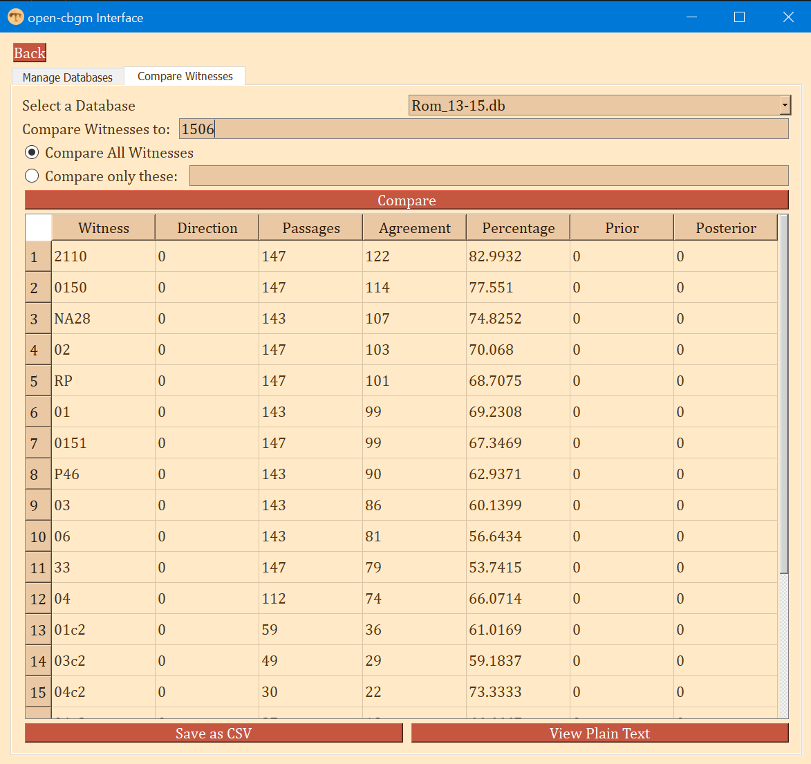
- This table is a simplification of the output from the open-cbgm. The full output can saved or viewed in the following ways:
  1. "Save as CSV" will save the data as a CSV file that can then be opened in Excel or any spreadsheet software.
  2. "View Plain Text" opens a popup with the full text output of the open-cbgm as one would see when operating the CLI. 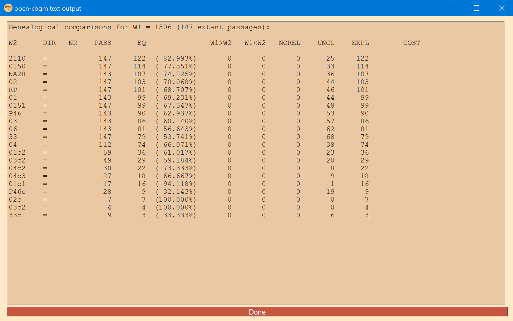

#### More features of the open-cbgm will be added over time.

###### I structured and generated the standalone desktop apps with [Beeware's Briefcase](https://github.com/beeware/briefcase).